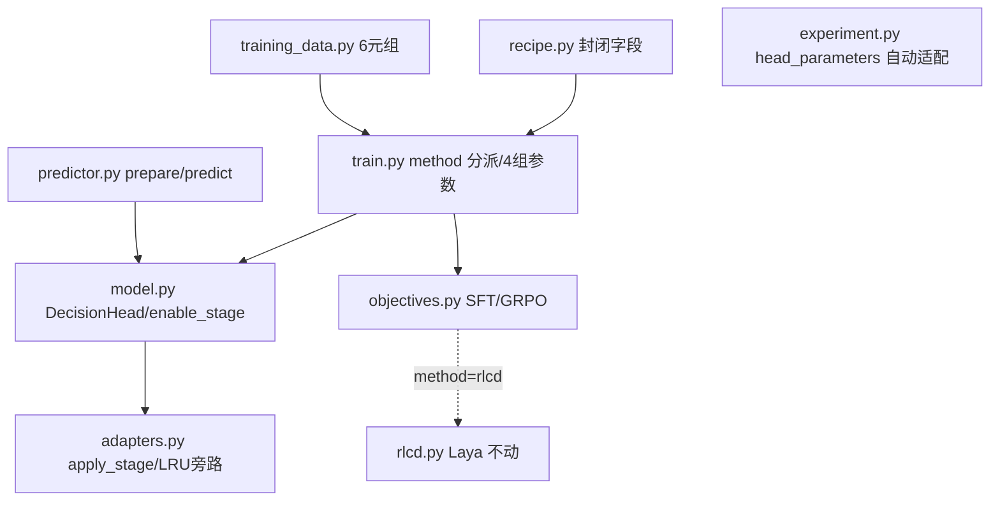

## 产品概述
在 Dohnuts 现有非生成式决策模型执行栈之上，**增量**引入 Valen 项目的模型表达力与训练策略，形成可由 recipe 字段切换、可对照实验的双路径体系。迁移严格保留 Dohnuts 的批量多题一次前向、共享前缀 KV 缓存、128MiB 图像特征 LRU 等效率优势，以及现有数据管线与 Laya RLCD 数值对齐。

## 核心功能
- **双投影决策头**：以 `dot(W_candidate·h_cand, W_decision·h_dec)/√P`（P=256）替换现有单 `nn.Linear(H,1)` 打分，参数量与候选数无关，读出/损失恒为 fp32。
- **decision 位置**：在题干末尾 `Options:\n` 处（不泄漏任何候选内容）新增决策读出位置，prompt 模板字符串保持不变，已转换数据与 token 预算不重跑。
- **四档 stage 参数开放**：`warmup / text / joint / vision_top`，按 stage 枚举 `language_model` 下全部 `nn.Linear` 应用可配 rank 的 LoRA，并可解冻 `visual.merger` 与顶 4 层视觉 block；对应 head/lora/merger/vision 四组独立学习率。
- **三选一训练目标**：`method ∈ {rlcd(默认,Laya), sft, grpo}` 并存。SFT 为分布交叉熵（可选 RPS/Brier）；GRPO 为多项式采样 + clip ratio + exact categorical KL + Brier，含固定参考模型语义。
- **checkpoint v2**：元数据扩展 stage/projection_dim/method/lora_alpha 与 GRPO reference 训练态；旧 v1 一律拒绝加载并给出明确迁移提示。
- **测试与冒烟**：CPU 小模型替身 + 数值闭式单测、GPU 单卡冒烟脚本、gui-v1 短预算三 method 训练冒烟。


## 技术栈选择
沿用 Dohnuts 现有栈，**不新增任何第三方依赖**：Python ≥3.12、PyTorch 2.9.1、transformers 5.17、**peft 0.21（已在依赖中，LoRA 复用）**、flash-linear-attention 0.5.2、ty/ruff/pytest 质量门禁。backbone 固定为本地 `Qwen/Qwen3.5-0.8B`（避免误用缺 `revision.txt` 的 2B）。Valen 的 `ArchitectureBackend/factory/interfaces` 抽象层、分布式、分区分区配置均不引入。

## 实现方案
**策略：同源语义对齐 + 增量替换，不破坏既有契约。** 三个正交改动面：
1. **模型表达力**：新增 `DecisionHead` 替换 `DecisionModel.head`；保持子模块名为 `head`，使 `n.startswith("head.")` 参数组分类与 `experiment.head_parameters` 统计**零改动自动适配**。
2. **参数开放粒度**：`adapt_language` 升级为 `apply_stage(stage, lora_rank, lora_alpha, training)`，LoRA target 由硬编码短名改为枚举 `language_model.named_modules()` 中的 `nn.Linear`（自动覆盖 gated-delta-net 的 `in_proj_*`/`out_proj`）；解冻集合按 stage 分档。
3. **训练目标**：新增 `src/dohnuts/objectives.py`（`SFTObjective` / `GRPOConfig` / `GRPOObjective`），`rlcd.py` 与其 golden fixture **一字不动**，由 `config["method"]` 分派。

**关键取舍（已确认）**：
- decision 读题干末尾而非 Valen 的 prompt 末尾 `Decision:` token —— 换取不改模板/不重跑 74GB 数据管线；因果注意力下 decision 向量看不到候选，是纯 query。
- GRPO `num_iterations` 默认 1（省一次前向，ratio≡1 退化为 PG+KL+Brier），可配 ≥2 才启用 clip。
- 视觉解冻（joint/vision_top）时**必须旁路** 128MiB LRU，否则缓存返回过期特征导致静默训错；代价是失去同 batch 重复截图复用。
- checkpoint v1→v2 **不向后兼容**：决策头参数键集已变，拒绝加载优于长期背负双头分支。

**性能与可靠性**：推理路径保持**一次 forward 出 `[B,K]`**，不引入 Valen 逐分支循环，`run_laya_benchmark.py`/`evaluate_upstream.py` 的单次 forward hook 断言不受影响。LoRA 枚举 + `get_peft_model` 为一次性开销；训练热路径新增仅一次 fp32 双投影点积（`[B,K,P]` 广播，K≤128、P=256，可忽略）。GRPO `beta>0` 时 `deepcopy(model)` 约 +1.7GB 显存，建议 GRPO 配 warmup/text。

## 兼容性梳理（Valen 组件 → Dohnuts）
| Valen 组件 | 结论 | 说明 |
| --- | --- | --- |
| 双投影 `DecisionHead` | **需适配** | Valen 假设 batch=1（`hidden[0,...]`）；Dohnuts 批量，需保留 `rows` 索引，公式与参数量一致 |
| `Decision:` token 位置 | **需替换** | 改为题干末尾 offset 定位（`return_offsets_mapping`），不改模板 |
| 丢词表输出层（`del container`） | **兼容** | Dohnuts `AutoModel` + 丢弃词表路径已达同效 |
| LoRA 枚举全部 Linear | **需适配** | 从硬编码 12 短名改为枚举；r/α 由 8/16 改为可配（默认保留 8/16 以维持现状） |
| 四档 stage / merger / 顶 4 层解冻 | **需适配** | 移植语义；`text` 档**不**强制纯文本（GUI 数据全带图，照搬则无数据可用） |
| 四组独立 LR 优化器分组 | **需适配** | 从 2 组扩到最多 4 组，无法归类直接报错（对齐 Valen） |
| 常数 LR（无调度器） | **替换为现状** | 保留 Dohnuts 的 warmup+cosine 调度（`factor × initial_lr`），优于 Valen 常数 LR |
| SFT loss（CE+RPS+Brier） | **需适配** | 新增 `SFTObjective`，默认权重 0；`ordinal` 标记 score 行使 RPS 仅对 score 行生效 |
| GRPO（采样/clip/KL/Brier/reference） | **需适配** | 新增 `GRPOObjective`，批量语义 + `reference_weights` resume 严格键集校验 |
| 分区配置 `config_version:2` | **不迁** | 保持 Dohnuts 扁平封闭 recipe，字段直接映射 |
| 分布式 / token 预算打包 / 逐 rank 状态 | **不迁** | 保持单卡 |
| Score 的 K 个独立分支 | **不迁** | 保留单分支 + `ordinal` RPS，避免破坏单次 forward 断言 |

## 配置合并与参数映射
Valen 分区 JSON 字段 → Dohnuts 扁平 `training_recipe()` 字段：

| Valen（model/training/objective） | Dohnuts recipe 字段 | 默认值 | 生效条件 |
| --- | --- | --- | --- |
| `objective.method` | `method` | `"rlcd"` | 始终 |
| `training.stage` | `stage` | `"text"` | 始终 |
| `model.projection_dim` | `projection_dim` | `256` | 始终 |
| `training.lora_rank` | `lora_rank` | `8`（现状） | stage≠warmup |
| `training.lora_alpha` | `lora_alpha` | `16`（现状硬编码） | stage≠warmup |
| `training.lora_lr` | `backbone_lr` | `1e-4`（现有） | lora 组 |
| `training.head_lr` | `head_lr` | `5e-4`（现有） | head 组 |
| `training.merger_lr` | `merger_lr` | `1e-5` | joint/vision_top |
| `training.vision_lr` | `vision_lr` | `2e-6` | vision_top |
| `objective.rps_weight/brier_weight` | `sft:{rps_weight,brier_weight}` | `0.0/0.0` | method==sft |
| `objective.rlcd{...}` | `grpo:{group_size,num_iterations,correctness_weight,confidence_weight,brier_weight,beta,clip_epsilon,advantage_epsilon}` | Valen 默认 | method==grpo |
| 现有 `sigma/ce_weight` | `rlcd:{sigma,ce_weight}` | 现状 | method==rlcd 且非默认 |

**封闭 schema 硬约束**：`train.py:main()` 以 `config == training_recipe(...)` 全等校验启动；所有新字段必须同时进 `training_recipe()` 与 `train.py` 的 `frozen` 字典，漏一处无法启动。迁移前旧 run 因 config 不等不能 resume，需 `--initialize-from` 重起。

## 系统架构（改动面示意）


## 实现注意事项
- **契约贯穿**：collator 五元组 → 六元组 `(inputs, positions, decision_positions, mask, target, ordinal)`，`to_gpu`/`prefetch_batches` 需按长度自适应；`evaluate()` 与训练循环解包同步更新。
- **marker 复核**：`adapters.py` 常量写作 `<|fim_suffix|>`，设计文档 §3 实测 marker 为 `<|fim_middle|>`→248062，实现时须核对并统一，避免错位。
- **decision 定位**：断言 `tokenizer.padding_side == "right"`；取「起始字符 < stem_chars 的最后一个非空 token」；必须有**不泄漏候选**的专门测试。
- **视觉冻结链路**：`DecisionModel.train()` 调 `freeze_vision` 仅 `visual.eval()`，不动 `requires_grad`，故不会清掉 joint/vision_top 梯度；加测试钉死该行为。
- **fusion detach**：`_dohnuts_norm_weight` 不可微，当前 stage 均不解冻语言塔 norm；解冻语言塔 norm 前必须先修 `fused_rms_norm`（本次不做）。
- **调用方兼容**：`tests/test_gui_data.py:1097` 与 `tests/test_android_control_data.py:2528` 的 `prompt, _ =` 需改三元；`scripts/prepare_*.py` 用 `[0]` 索引取 prompt、`scripts/audit_checkpoint.py` 只调 `evaluate()`，均无需改动。
- **提交约定**：`git commit -m "..." -- <显式路径>`；`data/processed/*`、`runs/` 不入 Git。

## 目录结构（改动清单）
```
dohnuts/
├── src/dohnuts/
│   ├── model.py          # [MODIFY] 新增 DecisionHead；score_hidden/forward 加 decision_positions；
│   │                     #          enable_lora→enable_stage；load_adapter 校验 format_version==2 与 metadata 的
│   │                     #          stage/projection_dim/lora_alpha；train() 复核视觉冻结不影响解冻
│   ├── adapters.py       # [MODIFY] apply_stage(LoRA 枚举 + merger/blocks[-4:] 解冻)；forward 按 _vision_trainable
│   │                     #          旁路 128MiB LRU；warmup 不建 LoRA；正确标记 _vision_trainable
│   ├── objectives.py     # [NEW] SFTObjective(CE+RPS+Brier, masked) 与 GRPOConfig/GRPOObjective
│   │                     #       (prepare 采样/reward/advantage、update clip+exact KL+Brier、
│   │                     #        state_dict/reference_weights resume 严格键集校验、未知键报错)
│   ├── predictor.py      # [MODIFY] render_question 返回 stem 字符长度；prepare 用 offset 算并返回
│   │                     #          decision_positions；predict 传入 model；from_checkpoint 读 stage/projection_dim
│   ├── training_data.py  # [MODIFY] DecisionCollator 返回 6 元组(含 decision_positions)；to_gpu 自适应
│   ├── recipe.py         # [MODIFY] training_recipe 增 method/stage/projection_dim/lora_alpha/
│   │                     #          merger_lr/vision_lr/sft/grpo；lora_rank 改可配
│   ├── train.py          # [MODIFY] method 分派；4 组参数(head/lora/merger/vision，无法归类报错)；enable_stage；
│   │                     #          6 元组解包；save/load/export checkpoint format_version 2 + training_state
│   ├── rlcd.py           # [不改动] Laya golden 隔离
│   └── experiment.py     # [不改动逻辑] head_parameters 自动适配，确认 environment 记录新字段
├── scripts/
│   └── smoke_valen_migration.py  # [NEW] GPU 单卡冒烟：四档解冻集合/梯度、双投影数值、LRU 旁路、
│                                 #       SFT 2 步下降、GRPO beta>0 reference 固定、checkpoint resume 等价、merge 后分布合法
├── tests/
│   ├── test_decision_head.py     # [NEW] 形状/fp32/手算点积/双位置梯度/scale 不入 state_dict/参数量 2·H·P
│   ├── test_objectives.py        # [NEW] SFT 对 F.cross_entropy 闭式；GRPO reward/adv/clip/KL/Brier 手算；
│   │                             #       常数奖励组 adv 精确 0 且 Brier 仍有梯度；未知键报错；软标签 correctness
│   ├── test_stages.py            # [NEW] 四档 trainable 集合精确匹配；LoRA 覆盖 in_proj_*/out_proj；
│   │                             #       warmup 无 LoRA；joint/vision_top 带梯度且 LRU 旁路；train() 不重冻结
│   ├── test_decision_position.py # [NEW] 落在 stem 内、不泄漏候选、右 padding 批内一致、含图/纯文本 stem
│   ├── test_metrics.py           # [MODIFY] checkpoint round-trip v2、metadata 校验、旧 v1 拒绝、GRPO reference resume
│   ├── test_gui_data.py:1097     # [MODIFY] prompt, _ = → prompt, _, _ =
│   └── test_android_control_data.py:2528  # [MODIFY] 同上
└── docs/
    ├── design.md / rlcd.md / run-experiment.md / inference.md  # [MODIFY] 双投影公式、stage 表、四组 LR、
                                                                 #          SFT/GRPO 选择与 num_iterations 取舍、decision 位置语义
```

